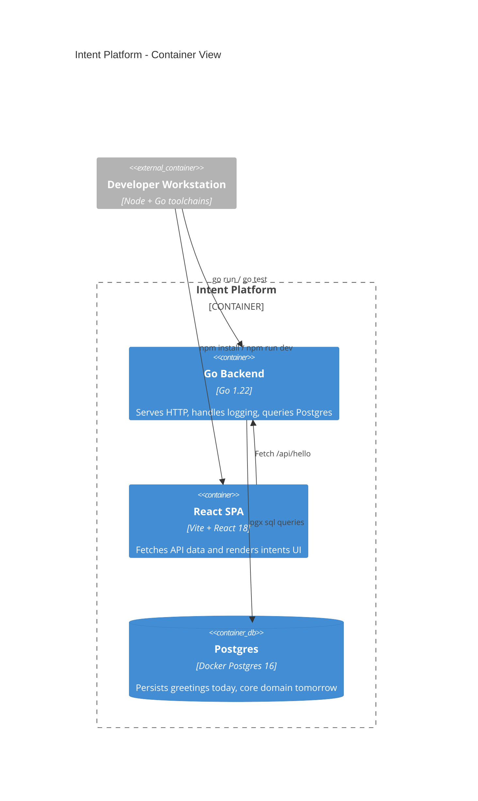

# Intent - Overview

**Why**

We believe our chapter time should unlock autonomy, mastery, and shared purpose — not just fill calendars. When 80 microservice engineers align around why they’re doing something, four hours together can create disproportionate impact.

**How**

By adopting intent-based leadership, every person declares what they intend to accomplish and why it matters. Chapter Leads set clear goals and guardrails, then the system helps align intents, form swarms, and capture outcomes inside our fixed Monday and Thursday windows.

**What**

An intent-driven web platform that turns chapter time into deliberate, outcome-focused collaboration — giving visibility to leaders, clarity to teams, and purpose to every session.

## Getting started

The repository now contains a full-stack hello world slice:

* **Backend** — Go 1.22 HTTP service with structured logging and Postgres connectivity.
* **API contract** — OpenAPI 3.1 definition describing the public surface.
* **Frontend** — React + TypeScript single-page app that calls the backend greeting endpoint.
* **Database** — PostgreSQL 16 via Docker Compose and a simple connectivity check (`SELECT 'Hello, Intent!'`).

### Prerequisites

* Go 1.22+
* Node.js 18+
* npm 9+
* Docker (for local infrastructure)

### Quick start (compose)

```bash
# build the frontend assets so the backend can serve them
cd frontend
npm install
npm run build

# in a new terminal, start postgres and the Go service
cd ..
docker compose up --build
```

The backend listens on <http://localhost:8080>. Vite’s dev server runs on <http://localhost:5173> if you prefer hot reloading (see below).

### Run services without Docker

```bash
# Terminal 1: Postgres (ensure it matches the .env.example defaults)
docker run --rm -p 5432:5432 -e POSTGRES_DB=intent -e POSTGRES_PASSWORD=postgres -e POSTGRES_USER=postgres postgres:16-alpine

# Terminal 2: backend
cd backend
cp .env.example .env # optional helper for local tooling
go run ./cmd/server

# Terminal 3: frontend
cd frontend
npm install
npm run dev
```

The Vite dev proxy forwards `/api` calls to the Go backend, keeping the SPA and API aligned.

### Testing

```bash
cd backend
go test ./...
```

## Interface details

| Surface            | Path         | Method | Description                                                |
| ------------------ | ------------ | ------ | ---------------------------------------------------------- |
| REST API           | `/api/hello` | GET    | Returns `{"message": "Hello, Intent!"}` from Postgres.    |
| Service health     | `/healthz`   | GET    | Plain text `ok` to integrate with probes.                  |
| Static web content | `/`          | GET    | Serves the built React application from `frontend/dist`.   |

The full API contract lives in [`api/openapi.yaml`](api/openapi.yaml) and will be the canonical artifact as additional endpoints are introduced.

## Logging

The backend uses Go’s `slog` JSON handler. Set `LOG_LEVEL` to `DEBUG`, `INFO`, `WARN`, or `ERROR` to adjust verbosity. Structured fields (`addr`, `signal`, `error`, etc.) are emitted to standard output for aggregation in the future platform observability stack.

## Architecture (C4 model snippets)

### System Context

```mermaid
C4Context
    title Intent Platform - System Context
    Person(member, "Chapter Member", "Declares intents and joins swarms")
    Person(lead, "Chapter Lead", "Sets guardrails and reviews outcomes")
    System_Boundary(platform, "Intent Platform") {
        System(api, "Intent API", "Go HTTP service")
        System_Software(frontend, "Intent Web App", "React + TypeScript SPA")
        SystemDb(db, "Operational Postgres", "Hello world schema placeholder")
    }
    System_Ext(calendar, "Calendar Provider")
    System_Ext(work, "Work Tracking")

    Rel(member, frontend, "Declares intents, reviews swarms")
    Rel(frontend, api, "REST + JSON")
    Rel(api, db, "SQL over pgx")
    Rel(lead, frontend, "Reviews goals, guardrails")
    Rel(api, calendar, "Future integration")
    Rel(api, work, "Future integration")
```

### Container Diagram



## Product backlog scaffolding

The following EPIC, FEATURE, and USER STORY catalog outlines the evolution path for the platform. These narratives guide the future vertical slices that will build on top of the hello world stack above.

# EPICs, FEATUREs and USER STORIES

Background and assumptions

- Objective: maximize the value of Chapter time by aligning individual intents to Chapter Leads’ goals, forming swarms, and delivering measurable outcomes within fixed windows: Monday 13:00–17:00 and Thursday 13:00–17:00.
- Scope: 80 engineers across 8 chapter instances; heterogeneous skills; multi-swarm work; integration with calendar, work-tracking, and messaging systems.
- Leadership model: intent-based leadership. Members state “I intend to …” with context, expected outcome, and guardrails. Chapter Leads provide clarity of goals and constraints rather than top-down tasking.
- Core objects: Goal, Intent, Swarm, Skill, Availability, Guardrail, Outcome, Session, Ritual, Metric, Integration.
- Constraints: only book work inside the two windows; protect focus time; make trade-offs visible.
- Success measures: percent of session time with clear intents; cycle time from goal to swarm; attendance and utilization within windows; outcomes delivered per session; skill coverage; member autonomy signals.

EPIC 1: Intent capture and alignment

Features

1. Intent composer
2. Goal catalog with clarity statements
3. Guardrails and decision-rights registry

User stories

    - As an engineer, I want to submit “I intend to” with context, expected outcome, and needed collaborators, so that my autonomy is explicit and inspectable.
    - As a Chapter Lead, I want to define goals with clarity statements, constraints, and success criteria, so that member intents align to purpose.
    - As an engineer, I want to see guardrails and decision rights for a goal, so that I can act without waiting for permission.
    - As a Chapter Lead, I want automated checks that flag intents violating guardrails, so that I can coach before the session starts.

EPIC 2: Swarm formation and timeboxing

Features

1. Swarm matchmaking by skill and intent fit
2. Session scheduler restricted to Mon/Thu 13:00–17:00
3. Swarm charters and working agreements

User stories

    - As an engineer, I want suggested swarms that match my intent and skills, so that I can join quickly.
    - As a facilitator, I want to timebox swarms to one or more session blocks, so that work respects the Chapter cadence.
    - As a swarm, we want a lightweight charter template capturing mission, definition of done, and guardrails, so that we share context before starting.
    - As a Chapter Lead, I want to limit the number of concurrent swarms per chapter instance, so that focus is preserved.

EPIC 3: Capacity and skills management

Features

1. Availability capture and calendar sync
2. Skill matrix with proficiency and interest
3. Capacity guardrails per chapter instance

User stories

    - As an engineer, I want my availability auto-synced from my calendar for Mon/Thu windows, so that scheduling reflects reality.
    - As a Chapter Lead, I want to see skill heat maps by chapter instance, so that I spot gaps before forming swarms.
    - As a scheduler, I want capacity limits that prevent overbooking individuals or chapters, so that we avoid burnout.

EPIC 4: Outcomes and evidence of learning

Features

1. Outcome logging tied to intents
2. Evidence repository links
3. Definition of done checklist

User stories

    - As a swarm, we want to submit outcomes against our stated intents with evidence links, so that value is auditable.
    - As a Chapter Lead, I want to review outcomes by goal across sessions, so that I can steer with facts.
    - As an engineer, I want a done checklist per goal that we can tailor, so that completion criteria are explicit.

EPIC 5: Rituals and cadence

Features

1. Session kickoff and close-out flows
2. Retrospectives with micro-surveys
3. Showcase board for demos

User stories

    - As a facilitator, I want a structured 10-minute kickoff to confirm intents, dependencies, and guardrails, so that the swarm starts aligned.
    - As a swarm, we want a 5-minute close-out flow to capture outcomes, obstacles, and next-intent drafts, so that learning compounds.
    - As a Chapter Lead, I want a showcase queue that schedules demos inside the window, so that visibility is routine.

EPIC 6: Notifications and nudges

Features

1. Pre-session intent nudges
2. Guardrail breach alerts
3. Quiet-time enforcement

User stories

    - As an engineer, I want a nudge 24 hours before a session to refine or declare my intent, so that the backlog of intents is fresh.
    - As a Chapter Lead, I want alerts when intents lack outcomes after a session, so that I can coach follow-through.
    - As a member, I want “do not disturb” set automatically during session blocks, so that focus is protected.

EPIC 7: Integrations

Features

1. Calendar integration
2. Work item sync with Jira or equivalent
3. Messaging integration for swarms

User stories

    - As a swarm, we want a chat channel auto-created with the charter pinned, so that coordination is immediate.
    - As an engineer, I want my intent to link to a Jira ticket or experiment doc, so that work is traceable.
    - As a scheduler, I want session events written to participant calendars, so that attendance is clear.

EPIC 8: Analytics and insights

Features

1. Autonomy and clarity dashboard
2. Utilization and flow metrics
3. Outcome-to-goal impact mapping

User stories

    - As a Chapter Lead, I want a dashboard showing percent of members with declared intents before each session, so that I can see clarity.
    - As an operations analyst, I want utilization and skill coverage by chapter instance, so that staffing decisions are data-driven.
    - As a leadership team, we want a map of outcomes to strategic goals, so that impact is visible.

EPIC 9: Roles, permissions, and governance

Features

1. Role-based access with decision-rights tags
2. Guardrail library and versioning
3. Audit trail of intents and approvals where required

User stories

    - As an admin, I want to assign roles like Member, Chapter Lead, Facilitator, Skill Steward, so that the system enforces the right privileges.
    - As a Chapter Lead, I want reusable guardrails for common work types, so that expectations are consistent.
    - As compliance, I want an immutable log of changes to intents, charters, and outcomes, so that audits are satisfied.

EPIC 10: Experience and accessibility

Features

1. Single-page web app optimized for quick intent capture
2. Mobile-friendly session check-in
3. Accessibility and keyboard-first flows

User stories

    - As a member, I want to declare intent in under one minute with inline validation, so that friction is low.
    - As a facilitator, I want a session roster view optimized for large screens, so that I can manage multiple swarms.
    - As any user, I want WCAG-compliant interactions and keyboard shortcuts, so that the app is inclusive and fast.

EPIC 11: Onboarding, learning, and coaching

Features

1. Intent writing guide and templates
2. Coaching prompts for Leads
3. Exemplars library

User stories

    - As a new member, I want templates for common intents like spike, refactor, design review, so that I start strong.
    - As a Lead, I want coaching prompts that suggest questions to raise when intents are weak, so that autonomy grows.
    - As a chapter, we want exemplars of high-quality intents and outcomes, so that we calibrate.

EPIC 12: Administration and security

Features

1. Tenant setup and SSO
2. Data retention policies
3. Backup and environment configuration

User stories

    - As an admin, I want SSO and SCIM provisioning, so that access is controlled.
    - As security, I want data retention settings per artifact type, so that we meet policy.
    - As an operator, I want environment config and backups, so that availability targets are met.

Selected acceptance criteria patterns

- Intent must include context, expected outcome, timebox, and guardrail acknowledgment.
- Scheduler cannot place work outside Monday 13:00–17:00 or Thursday 13:00–17:00.
- A swarm cannot start without a charter containing definition of done and decision-rights tags.
- Outcomes must reference at least one intent and optionally link to evidence.
- Analytics compute intent coverage by T-24h and T-1h before each session.

Nonfunctional requirements

- Reliability: 99.9 percent monthly uptime target.
- Performance: intent save and roster actions under 200 ms p95 within region.
- Security: SSO, least-privilege roles, encrypted at rest and in transit.
- Privacy: retain personal intent history for 12 months unless policy overrides.
- Interop: calendar, work tracking, and messaging integrations are pluggable via adapters.

Data model sketch

- Goal(id, title, clarity_statement, constraints, metrics)
- Guardrail(id, description, decision_rights, scope, version)
- Intent(id, member_id, goal_id, context, expected_outcome, needed_skills, desired_collaborators, session_id, status)
- Swarm(id, charter, lead_ids, member_ids, skills, session_ids)
- Session(id, chapter_instance_id, date, window, roster, facilitator_id)
- Outcome(id, intent_id, description, evidence_links, dod_checklist)
- Skill(id, name, proficiency, interest)
- Availability(id, member_id, session_id, status)

Example user journey inside a session window

1. T-24h: Members refine intents. Nudges ensure coverage.
2. T-1h: Matchmaking finalizes swarms within capacity and skill guardrails.
3. T-0: Kickoff ritual confirms mission and decision rights.
4. During: Quiet-time enforcement and progress notes.
5. T+0: Close-out logs outcomes and next intents.
6. After: Analytics update, retro micro-survey triggers, showcase queue scheduled.
